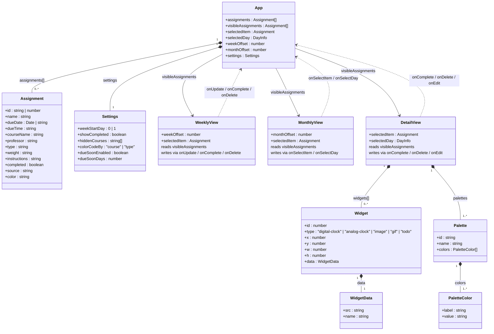

# Reactive Sandbox — Three-Panel System
**AI 201 — Project 2 | SCAD Spring 2026**

---

## Design Intent

**Concept**
System: Productivity / academic calendar.
Domain: Website
Problem: Certain productivity / calendar websites and iOS apps do not have simple systems to upload class syllabi that can be directly imported to the website / app. For example, with Notion, I have to manually create a calendar and put in all of the individual professors, classes, details, etc.
Solution: Creating something similar to Notion / Google Calendar where the user can directly upload a class syllabus to the website, and the information will automatically be downloaded and updated.

**Mood**
Calming while encouraging productivity; clean.

**Color**
Color schemes within the website can be changed to better complement the user's mood. Multiple curated palettes are available; the default palette is a muted, earthy tone set.

**Typography**
Clean and legible. Details like class name, assignment name, and due date carry higher hierarchy compared to supporting details like assignment description and professor name.

**Layout**
Three panels: weekly progress tracker (top-left), monthly calendar (bottom-left), and detail view (right). Weekly and monthly share the left column; detail occupies the full right column.

---

## The Three Panels

**The Browser — Weekly Progress Tracker**
The weekly view helps the user track productivity for the week. It shows all assignments and tasks due that week as a progress tracker with an overall progress bar and per-day mini bars. Items are color-coded by course or type. Clicking an item opens it in the Detail panel. Completing an item from the Detail panel triggers a strikethrough animation and, when the week hits 100%, a confetti celebration with an "All done for the week!" overlay.

**The Detail View**
When the user selects an assignment or task from the weekly or monthly view, the detail panel shows full information: class name, professor, due date, description, point value, and submission type — along with action options (complete, edit, delete). When no item is selected, the panel returns to its decorative widget state (clock, image, GIF, or to-do list widgets).

**The Controller — Monthly View**
A full monthly calendar showing all assignments and tasks at a glance. Higher-hierarchy info (due date, assignment name) is more prominent; lower-hierarchy info (task type) is subdued. Clicking a day surfaces that day's items in the detail panel. Settings like week start day, due-soon highlighting, hidden courses, and color-code mode are controlled here.

---

## Data Model

**The Assignment (primary item)**
Pulled automatically from an uploaded syllabus:
class name, professor, assignment title, due date, due time, description, point/percentage value, assignment type (quiz, essay, reading, etc.), and completion status.

**The Task (secondary item)**
Entered manually by the user:
task name, due date, due time, description, and completion status. Stored in the same `assignments` array with `source: 'todo'`.

**State Fields**
The parent `App` component owns all state. Every panel receives data via props — no duplicated state. A change made in the detail panel writes back to `App`, which propagates the update to both calendar panels simultaneously.

---

## Interaction Rules

**Selection Behavior**
When selected, an item receives a 3px border matching its color at 50% darker. The detail panel slides in from right to left. When no item is selected, the detail panel returns to its decorative widget state.

**Controller Behavior**
Clicking a day in the monthly calendar surfaces that day's items in the detail panel without changing the weekly view's current week. A "Today" button appears in the weekly header whenever the user has navigated away from the current week, allowing a one-click return.

**Empty / Default State**
On first load, all panels are visible behind a centered prompt card asking the user to upload a syllabus or start creating tasks. Once dismissed, the full three-panel layout is shown.

---

## What I Will Not Compromise On

- Layout must match the original sketch
- Color palette cannot change unless the user explicitly selects a different one
- Assignment items must always show the due date at a glance
- The detail view must always be visible — either in detail state or decorative state
- The monthly and weekly views must always reflect the current week/month unless the user navigates away (with a visible "return" button when they do)

---

## Data Architecture

---

## AI Direction Log

**Entry 1 — Fixing the PDF Date Parser**
The AI's initial PDF extraction joined all text on a page into a single string, which caused every assignment to land on the same date (whatever the first date on the page was — usually a week header). I directed the AI to fix the extraction at the source by reconstructing actual lines using each text item's y-position from the PDF.js data. This required understanding the underlying document structure, not just patching the surface.

**Entry 2 — Replacing the Weekly Calendar with a Progress Tracker**
After the calendar-style weekly view was built, I decided it wasn't the right format for the panel. I directed a full replacement: a progress tracker with an overall bar, per-day mini bars, items that open in the detail panel on click, and a confetti + "All done for the week!" celebration when the week hits 100%. The AI had to restructure the entire component around a different interaction model while preserving the shared state architecture.

**Entry 3 — Celebration Animation System**
I directed the AI to build a specific multi-layered celebration: the progress bar bounces and glows, 55 confetti pieces burst from the bar's edge with randomized arc trajectories, and an overlay fills the day grid with the palette's accent hue at 50% opacity with a gaussian blur — without blurring the bar above, so the user can still navigate to other weeks. Each constraint was deliberate and added one at a time.

**Entry 4 — Removing Proximity Items**
The AI built a full "Coming Up" proximity section — items due within N days after the week, shown faded with dashed borders, with an "Start working early?" popup. After seeing it in the UI, I decided it added complexity without enough value and directed the AI to remove it entirely, including all state, handlers, CSS, and the settings field that controlled it.

**Entry 5 — Unifying All Three Panels to One Data Source**
During a data architecture review, I identified that the weekly view was receiving raw `assignments` while the monthly view received `visibleAssignments` (filtered by settings). I directed the fix so all three panels read from the same filtered source — one change in App.jsx that enforces the single source of truth the PRD required.

---

## Records of Resistance

**Resistance 1 — Hardcoded Placeholder Data**
When the three panels were first built, the AI populated both the weekly and monthly views with its own made-up placeholder items. I flagged that none of the data matched what was actually in my syllabi. The fix was removing all placeholder arrays entirely — panels now only show data from the uploaded source.

**Resistance 2 — Syllabus Dates All Landing on the Same Day**
After upload, nearly every assignment was being assigned the same due date regardless of what the syllabus actually said. The AI's PDF extraction was joining all text on a page into a single string, which destroyed the document's line structure. The parser would then grab the first date it found on the page — usually a week header — for every assignment. I directed a structural fix: reconstruct lines using each text item's y-coordinate from PDF.js so the parser receives the document the way it was actually written.

**Resistance 3 — The 24-Hour Clock**
The AI built the detail panel's decorative clock in 24-hour format. I flagged it immediately. A small assumption, but the kind that slips through when the AI fills in unspecified details on its own.

**Resistance 4 — Popups Rendering Behind Panels**
Multiple popups (palette editor, date picker, upload menu, settings) were rendering underneath sibling panels instead of on top of everything. The AI's first attempt was adjusting z-indexes, which didn't solve it. I pushed back and directed a proper fix: the root cause was `backdrop-filter` on the glass panels creating a CSS stacking context that trapped children inside it. The solution was portaling every popup to `document.body` with coordinates from `getBoundingClientRect()` — a pattern that then got applied consistently across the entire app.

**Resistance 5 — Palette Colors Not Affecting Event Cards**
After the palette editor was built, changing event colors had no visible effect on the calendar cards. The AI had hardcoded hex values in the color arrays inside both calendar components instead of referencing CSS variables. I directed the fix: replace all hardcoded values with `var(--color-X)` so the browser resolves them at paint time and the palette editor's live preview works without any React re-render.

**Resistance 6 — Navigation Arrows Pointing the Wrong Way**
The "Today" and "This Month" return buttons had directional arrows pointing inward toward the label text instead of outward toward where the current date actually was. I directed the arrows to be swapped so they point away from the text — toward the destination, not back at the label.

**Resistance 7 — Background Blobs Invisible**
After building the background blob animation, the blobs were invisible. The gradient colors the AI chose were nearly identical to the background color, so they blended in completely. I flagged it and directed a visible contrast fix.

**Resistance 8 — Panel Heights Too Squished**
After the weekly view was redesigned as a progress tracker, the panel felt cramped. The AI's default flex proportions didn't give the progress tracker enough vertical room. I directed a specific 30px increase to the weekly panel height, with the monthly panel adjusted down by the same amount to keep the layout balanced.

**Resistance 9 — Clock Aspect Ratio Locking**
The AI added fixed aspect ratio constraints and font scaling tied to widget size on the digital and analog clocks. I didn't ask for this and it made the widgets feel rigid. I directed it to be removed so both clocks resize freely without any proportional locking.

**Resistance 10 — Proximity Items Scrapped**
The AI built a full "Coming Up" section — proximity items due within N days after the week end, shown faded with dashed borders, with a popup asking "Start working early?" I had directed the feature initially, but after seeing it in the interface it added complexity without enough payoff. I directed the AI to remove the entire feature: all state, handlers, CSS, and the settings field tied to it.

---

## Five Questions Reflection
1. **Can I defend this?** Yes, I can. I was the designer of this project, therefore, I designed every major decision. I can accurately describe design intentions and answer any questions.

2. **Is this mine?** Before starting this project, I gave Claude my design intent and emphasized how I am the designer -- Claude was to simply follow my instructions. Because of this, I can confidently say that this Reactive Sandbox is mine, not Claude's. There were one or two times where I asked Claude for its opinion, but ultimately I decided whether or not it aligned with my design intent and was usable. 

3. **Did I verify?** Yes, I went through each panel and checked the functionality of the buttonsand features, as well as made sure design intents were visible and working. 

4. **Would I teach this?** Yes, I believe that I have a very good understanding of how to use Claude to vibe code the start of a simple application. I'd be able to get others to the same point as myself through memory and referencing my checkpoints and looking at the human directions.

5. **Is my documentation honest?** Yes. Claude documented every prompt and areas of success/resistance. They can be found in the "checkpoints" folder.